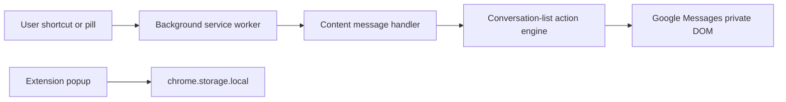

# Google Messages Shortcuts Product Roadmap

## Product decision record

The extension will target **keyboard-first personal productivity for frequent desktop texters** on Chrome and Chromium browsers. It will remain **free, open source, local-only, and telemetry-free**.

- Conversation-list actions remain the stable core.
- Compose and message-content workflows are intentionally in scope, but each begins with a feasibility spike because the present code only automates conversation-row menus.
- Persistent content features must be explicitly enabled, scoped to the active Google account, retention-configurable, and removable. Default: no message indexing; draft recovery defaults to a conservative 30-day retention.
- Current-conversation search starts with loaded messages only. A user-started older-history loader is a later experiment, never an implicit scan and never described as a complete history search.
- Include an internationalization track for Google Messages interfaces and extension UI.

## Current implementation and technical baseline

The existing MV3 extension has a narrow, well-tested DOM-automation architecture:

- [manifest.json](manifest.json) permits only `storage`, `tabs`, and content scripts on `https://messages.google.com/web/*` (Phase 0 confirmed the web client path is sufficient); it defines four browser-level commands (Open Archived is page-level because of Chrome's command limit).
- [src/content/conversation-action.js](src/content/conversation-action.js) serializes row-menu actions, with safe archive, trash confirmation, mark-unread flows, and native focus-only block/report spam confirmation.
- [src/content/google-messages-dom.js](src/content/google-messages-dom.js) is the private-DOM contract. It currently knows only list-row selectors and English fallback menu labels.
- [src/content/conversation-shortcut-pills.js](src/content/conversation-shortcut-pills.js) injects pills and observes focus/read-state changes only in the conversation list.
- [PRIVACY.md](PRIVACY.md) accurately promises that no content, contacts, identifiers, or analytics are stored or transmitted today; it must change before any opt-in local content feature ships.
- [vitest.config.js](vitest.config.js) requires 100% coverage, so every roadmap item includes unit tests and deterministic DOM fixtures.

## Actionable findings and scoring

Scores use 1–5. **Impact** is expected value for the target user. **Difficulty** includes DOM uncertainty, privacy implications, and test burden in this repository.

### Foundation and reliability

| Finding and action | Impact | Difficulty | Why it matters |
| --- | --- | --- | --- |
| Centralize Google Messages selectors, capabilities, and action metadata behind a page-adapter boundary | 5 | 3 | Every current and future feature depends on a private, changing DOM. Isolating this contract prevents feature code from embedding selectors. |
| Add a non-destructive capability self-test and unsupported-feature state | 5 | 3 | Prevents an outdated selector from acting on the wrong UI element after Google changes the page. |
| Add in-page success, failure, and recovery feedback | 4 | 2 | Current failures are mainly console warnings; users need a visible explanation and retry guidance. |
| Narrow host permission from the full origin to the web client path when verified | 3 | 1 | Reduces permission scope and strengthens store trust without changing product behavior. |
| Add an explicit extension pause/reset and content-data deletion control | 5 | 2 | Required for troubleshooting and the planned local content store. |
| Establish locale-aware action labels and selector fallbacks | 4 | 4 | The current English text fallback is insufficient for international interfaces; data attributes must remain primary. |

### Keyboard workflow and conversation processing

| Finding and action | Impact | Difficulty | Why it matters |
| --- | --- | --- | --- |
| Add a page-level keyboard controller that respects editable fields, IME composition, selected text, and browser shortcuts | 5 | 4 | Required before introducing single-key navigation without breaking typing. |
| Add a searchable command palette with visible bindings and a `?` shortcut reference | 5 | 4 | Gives users discovery before memorization and unifies list, compose, and content commands. |
| Add next/previous conversation, open, return-to-previous, focus search, focus composer, and escape-to-list | 5 | 4 | Closes the current mouse-dependent navigation gap. |
| Add next/previous unread and an unloaded-list coverage indicator | 5 | 4 | Directly addresses unread processing while avoiding false claims of complete coverage. |
| Add mark-read and mute/unmute after live selector validation | 4 | 2 | These extend the existing menu-action pattern and provide high-value inbox triage. |
| ~~Add configurable pill visibility and selected-row-only targeting~~ **Complete (1.10.0):** popup select with hover-or-focus (default), selected-row-only (`is-focused="true"`), and hidden modes | 3 | 2 | Lets keyboard-first users reduce visual noise and accidental hover targeting. |
| Add block/report-spam only with confirmation and capability checks (shipped in 1.9.0) | 3 | 3 | Pill-only action opens the native dialog and focuses the final confirm control without auto-clicking; live en-US `OK` confirm label validated. |
| Add injected Archived FAB beside Start chat and page-level shortcut to open Archived (shipped with unarchive in 1.8.0) | 4 | 3 | Reduces navigation friction to the archived modal before unarchive pills run. |
| Future: injected FAB and page-level shortcut for Spam and blocked (same pattern as Archived) | 3 | 3 | Deferred until native entry selectors are validated. |
| Future: page-level keyboard shortcut for native Start chat (`a[data-e2e-start-button]`) | 3 | 2 | Deferred until keyboard collision checks pass in live validation. |
| Defer keyboard bulk operations until Google’s native multi-select state can be reliably inspected | 4 | 5 | The current single-row engine cannot safely generalize to queued destructive actions. |

### Compose and message-content expansion

| Finding and action | Impact | Difficulty | Why it matters |
| --- | --- | --- | --- |
| Build a compose-adapter feasibility spike for focus, editor read/write, send state, and composer mutations | 5 | 5 | All requested compose features depend on selectors and side effects that do not exist in the codebase today. |
| Build a local templates/snippets spike with explicit insertion preview | 4 | 4 | High-frequency typing savings, but the extension must never overwrite an existing draft or accidentally send. |
| Build current-conversation search for currently loaded message nodes | 5 | 5 | Strong retrieval value, but message identity, virtualized DOM, and rendering change risk are substantial. |
| Add user-visible search coverage metadata: loaded message count and oldest/newest captured timestamps | 5 | 3 | Makes a zero-result safe to interpret as “not in loaded content,” not “does not exist.” |
| Prototype an explicit load-older-history search helper as a later experimental path | 3 | 5 | It may change read state or be incomplete. It must be cancellable, visibly bounded, and opt-in per run. |
| Build draft-recovery spike that snapshots unsent compose text locally, only after detecting a stable account/conversation key | 4 | 5 | Draft loss is consequential; wrong-account or wrong-thread restoration would be a severe privacy/correctness bug. |
| Ship opt-in draft recovery with review-before-restore, short configurable retention, and one-click deletion | 4 | 4 | Makes the feature safe only after identity and composer behavior are demonstrated. |
| Add a local data store with schema versioning, per-account namespaces, retention cleanup, size bounds, and export/delete controls | 5 | 5 | A shared prerequisite for templates, draft recovery, and any future index. |
| Keep full cross-conversation content indexing deferred | 4 | 5 | It would require safe incremental capture, deduplication, removals, account isolation, and clear completeness semantics. |
| Defer scheduled/unattended sending | 2 | 5 | Chrome alarms cannot guarantee an awake browser or successful delivery; automated sending creates unacceptable trust risk. |

### Trust, accessibility, and delivery

| Finding and action | Impact | Difficulty | Why it matters |
| --- | --- | --- | --- |
| Update privacy policy, popup disclosures, and README for every local-content feature | 5 | 2 | The current no-storage promise must not become inaccurate. |
| Add keyboard-accessible overlay semantics, focus trapping/restoration, screen-reader labels, and RTL test cases | 5 | 4 | The keyboard-first product must work without a pointer and in RTL layouts. |
| Use a live UI compatibility matrix across Chrome/Chromium, English plus priority non-English locales, personal/group chats, and account switching | 5 | 4 | Unit tests alone cannot verify Google’s private production DOM. |
| Keep content and identifiers out of logs, support reports, and any future diagnostics | 5 | 2 | Preserves the selected strict local-only trust model. |

## What is feasible, conditional, and out of scope

### Feasible now or after live DOM validation

- Additional conversation-row menu actions: mark read, mute/unmute, unarchive (archived modal), and block/report spam (shipped 1.9.0).
- Navigation shortcuts: open Archived (page-level); future Start chat and Spam and blocked entry points.
- Command palette, keyboard help, list focus/navigation, improved feedback, preference controls, and a selector-health check.
- Templates, loaded-message search, and draft recovery **only after** the compose/message feasibility spikes demonstrate stable DOM anchors and account/conversation identity.
- Local-only storage using `chrome.storage.local` or IndexedDB, with explicit consent and data lifecycle controls.

### Conditional and gated

- Unread traversal/filtering: implement only if unread markers are reliable across loaded and virtualized list items, and disclose coverage.
- Older-message loading: experimental, user-triggered, cancelable, and bounded; ship only if it does not silently mutate state or produce misleading coverage.
- International support: data attributes first, localized fallback strings second. Each locale receives a manual compatibility test before claiming support.
- Notifications/reminders: possible with new permissions and careful UX, but not a first roadmap commitment because they expand scope and cannot guarantee delivery while Chrome or the computer is unavailable.

### Not credible for this product now

- Repairing Google Messages pairing, phone synchronization, RCS delivery, or browser page-load failures. The extension can surface observed status and troubleshooting guidance but cannot fix Google’s service.
- A replacement Google Messages client or a direct protocol integration. There is no supported consumer API established for that path.
- Guaranteed delivery confirmation, unattended scheduled sending, or a complete backup/recovery product.
- Full-history global search before the extension proves safe content capture, stable identity, and correct virtualized-list behavior.
- Firefox support in this roadmap, by product decision.

## Delivery plan

### Phase 0: product and DOM discovery gate

1. Inventory native Google Messages keyboard behavior and page structure against a signed-in test account. Record selectors, roles, keyboard collisions, virtualized-list behavior, account-switch behavior, read-state effects, and available row-menu actions.
2. Create representative, sanitized DOM fixtures from each supported UI state. Do not include personal messages, phone numbers, or account data.
3. Define the page-adapter interfaces: list, menu actions, composer, message pane, and connection/status detection. Implement no user-facing compose or content feature until the adapter identifies stable anchors.
4. Define a compatibility contract and capability states: supported, unavailable, and unsafe. Every command must fail closed.
5. Establish acceptance tests for English, an RTL locale, a non-English LTR locale, personal/group threads, unread/read rows, archive/trash context, account changes, and slow DOM updates.

### Phase 1: make the existing product reliably extensible

1. Refactor [src/content/google-messages-dom.js](src/content/google-messages-dom.js) into selector and capability modules while retaining primary `data-e2e-*` selectors and controlled locale fallbacks.
2. Refactor [src/content/conversation-action.js](src/content/conversation-action.js) into an action registry so new actions declare selector, fallback label, precondition, confirmation rule, and postcondition.
3. Add an on-page action-feedback component, a pause/reset control, and a capability self-test. Unknown or unsupported actions must not open a menu.
4. ~~Narrow permissions if Phase 0 confirms `/web/*` is sufficient. Update contract tests for the manifest.~~ **Complete:** content scripts match `https://messages.google.com/web/*`; runtime tab checks enforce the same path.
5. ~~Add mark-read and mute/unmute only where Phase 0 confirms correct selectors and state detection. Include test fixtures and confirmation behavior for each destructive action.~~ **Complete:** matrix-approved row actions shipped through 1.9.1, including block / report spam with native focus-only confirmation.
6. ~~Update [README.md](README.md), [PRIVACY.md](PRIVACY.md), popup text, and release notes to state precise supported behaviors.~~ **Complete (2026-10-02):** Phase 1 user-facing docs aligned with the stable action set; locale expansion remains Phase 5.

### Phase 2: keyboard-first navigation and discovery

1. Add a context-aware page keyboard controller. It must ignore keystrokes in editable controls, during IME composition, and while text is selected unless a modifier-based command is explicitly intended.
2. Add list navigation, open, previous-conversation return, search focus, composer focus, escape-to-list, and unread traversal.
3. Add a command palette and shortcut overlay that list command availability, custom bindings, and unsupported features. Use page-level handling for page actions and `chrome.commands` only for browser-level entry points.
4. Add focus restoration, ARIA semantics, and RTL layout behavior for every injected surface.
5. Ship a user-visible limitation when results are based only on loaded list items. Never hide the native list in a way that prevents access to new conversations.

### Phase 3: three feasibility spikes for expansion features

Run these as separate, testable spikes. Each delivers a short evidence report and either a shippable capability contract or a documented stop decision.

1. **Templates spike:** determine how to focus the editor, inspect existing draft text, insert at the cursor, preserve undo behavior, and avoid sending. Prototype local templates with no message capture.
2. **Current-conversation search spike:** determine message-node identity, author/timestamp extraction, virtualized rendering limits, highlight behavior, and safe navigation to a match. Search only loaded nodes.
3. **Draft-recovery spike:** determine account and conversation identity, mutation observation reliability, debounce behavior, and how to restore without overwriting a live draft.

Reject any spike that cannot satisfy fail-closed behavior, account isolation, a disclosure of coverage, and sanitized automated tests.

### Phase 4: safe local content workflows

1. Add a local-data module with namespaced keys, schema migrations, retention policy, data-size caps, per-feature opt-in, account-change invalidation, and deletion controls.
2. Ship templates first if its spike is successful: local template manager, keyboard invocation, previewed insertion, and non-destructive conflict handling.
3. Ship current-conversation loaded-content search if its spike is successful: find UI, next/previous matches, highlighted results, explicit loaded-coverage facts, and clear-data control if any index is persisted.
4. Ship draft recovery if its spike is successful: opt-in, conservative 30-day default, review-before-restore, never overwrite a non-empty active draft, and delete-by-thread/account/all controls.
5. Consider the older-history loader only after the loaded-content search is dependable. Make it explicit, cancelable, state-safe, and labeled experimental.

### Phase 5: internationalization, validation, and maintenance loop

1. Move extension UI strings, fallback menu labels, and accessibility text into locale resources. Keep `data-e2e-*` selectors as the source of truth.
2. Define priority locales from project feedback, including at least one RTL interface. Test localized fallback behavior manually against live Google Messages UI.
3. Validate non-English LTR Google Messages UI chrome and block/report spam confirm dialog labels outside en-US before claiming locale support.
4. Add a no-content support report that captures extension version, capability state, browser version, and selector status only with an explicit user copy/download action.
5. Publish a compatibility matrix, a troubleshooting pause mode, a public changelog, and a feature-request path. Do not collect analytics or message content.
6. Re-run the live compatibility suite whenever Google Messages changes the DOM or an extension release changes adapter code.

## Testing strategy

- Preserve 100% unit coverage, extending the fixture library rather than lowering thresholds.
- Unit-test selector capability checks, action preconditions, keyboard context guards, local-store retention/migrations, account isolation, template insertion safety, and draft conflict resolution.
- Add integration-style JSDOM tests for palette focus behavior, compose adapters, loaded-message search coverage labels, and data-deletion controls.
- Use manual live Google Messages checks for private DOM validation. Do not automate real conversations, send real messages, or retain personal data in test artifacts.
- Test destructive actions only against dedicated test conversations and retain confirmation requirements unless native behavior is unambiguous and the user has opted into automation.

## Decision gates and launch criteria

- Do not implement a row action until the live UI exposes a stable primary selector or a locale-tested fallback.
- Do not ship a compose/content feature until its spike establishes stable targets, a fail-closed state, a privacy disclosure, and a full deletion path.
- Do not claim “search all messages” unless coverage across unloaded history has been proven. Initial copy must say “search loaded messages in this conversation.”
- Do not restore drafts automatically or over a non-empty native draft.
- Ship a capability only if the core workflow can be completed without a pointer, preserves normal typing and IME behavior, and passes accessibility/focus tests.

## Open inputs to validate during Phase 0

- Exact native keyboard bindings and conflict behavior in current Google Messages Web.
- Available `data-e2e-*` selectors for mark-read, mute, unarchive, composer, messages, and connection state.
- Whether message and thread identity can be made stable without recording sensitive content.
- The side effects of loading older history, opening a conversation, and observing the composer.
- The priority locales for initial international support.
