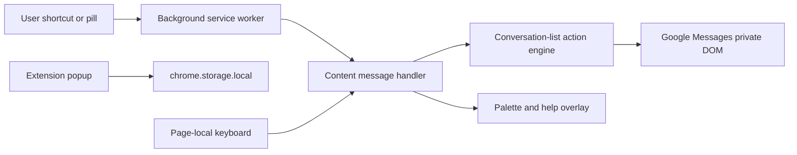

# Architecture

Technical baseline for Messages Shortcut Actions (Manifest V3).

## Runtime flow

## Key modules

| Area | Location | Role |
| --- | --- | --- |
| Manifest and commands | [manifest.json](../manifest.json) | Seven browser-level commands (four with suggested keys, three optional navigation commands). Content scripts on `https://messages.google.com/web/*`. |
| Row actions | [src/content/conversation-action.js](../src/content/conversation-action.js) | Serialized row-menu actions: archive, trash, mark unread, mute, block/report spam, and related flows. |
| DOM contract | [src/content/google-messages-dom.js](../src/content/google-messages-dom.js) and adapters | Private-DOM selectors, capabilities, and locale fallbacks. |
| Page keyboard | Content keyboard controller and context guards | Page-local navigation, palette, and help; ignores editable fields, IME, dialogs, and row menus. |
| Composer | [src/content/adapters/composer-dom.js](../src/content/adapters/composer-dom.js) | Composer focus via live-validated selectors; draft read/insert/send remain deferred. |
| Pills | [src/content/conversation-shortcut-pills.js](../src/content/conversation-shortcut-pills.js) | Injected pills; observes focus and read-state in the conversation list. |
| Preferences | Popup and [src/shared/pause-preference.js](../src/shared/pause-preference.js) | Local settings including pause, pill visibility, and trash auto-confirm. |

## Privacy boundary

[PRIVACY.md](../PRIVACY.md) describes current behavior: no conversation content, contacts, or analytics are stored or transmitted. That document must change before any opt-in local content feature ships (Phase 4).

## Testing expectations

- [vitest.config.js](../vitest.config.js) requires **100% unit coverage**. Extend the fixture library rather than lowering thresholds.
- Unit-test selector capability checks, action preconditions, keyboard context guards, local-store retention/migrations (when added), account isolation, template insertion safety, and draft conflict resolution.
- Add integration-style JSDOM tests for palette focus behavior, compose adapters, loaded-message find coverage labels, and data-deletion controls.
- Use manual live Google Messages checks for private DOM validation. Do not automate real conversations, send real messages, or retain personal data in test artifacts.
- Test destructive actions only against dedicated test conversations and retain confirmation requirements unless native behavior is unambiguous and the user has opted into automation.

Live validation workflow:

- [live-validation-checklist.md](dom-discovery/live-validation-checklist.md)
- [compatibility-matrix.md](dom-discovery/compatibility-matrix.md)
- [fixture-sanitization.md](dom-discovery/fixture-sanitization.md)
- [phase1-action-decisions.md](dom-discovery/phase1-action-decisions.md)
